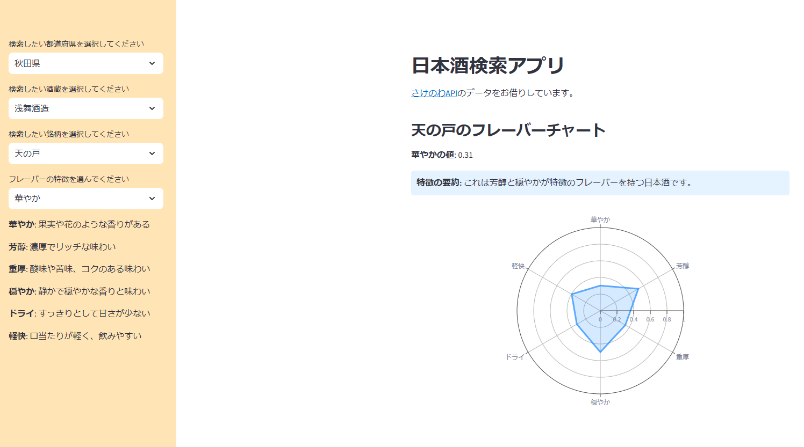

# 日本酒検索アプリ（sake-search-app）

## 概要
このアプリは、日本酒に関する情報をAPI経由で取得し、ユーザーが検索・閲覧できるようにしたWebアプリです。  
都道府県や酒蔵、特徴などで絞り込みができ、日本酒選びの参考になります。  
Streamlit を使って構築しており、Webブラウザ上で直感的に操作できます。

## 使用技術
- Python 3.x
- [Streamlit](https://streamlit.io/)
- pandas
- requests
- plotly

## 主な機能
- 日本酒の検索（地域・酒蔵・特徴で絞り込み）
- 特徴に応じたグラフ表示（plotlyによる可視化）
- 日本酒データの取得（外部APIを使用）

## 実行方法（ローカル環境）

1. リポジトリをクローン：

```bash
git clone https://github.com/hayashi090/sake-search-app.git
cd sake-search-app

	2.	必要なライブラリをインストール：

pip install -r requirements.txt

	3.アプリを起動：

streamlit run sake_kensaku3.py

	4.ブラウザが自動で起動し、アプリが表示されます（http://localhost:8501）

スクリーンショット


## 検索画面の例：



---

## 備考

	- 日本酒情報は「さけのわ」（https://sakenowa.com）などのデータを参照しています
	- 本アプリは学習・ポートフォリオ目的のものであり、商用利用はご遠慮ください

ライセンス

MIT License
